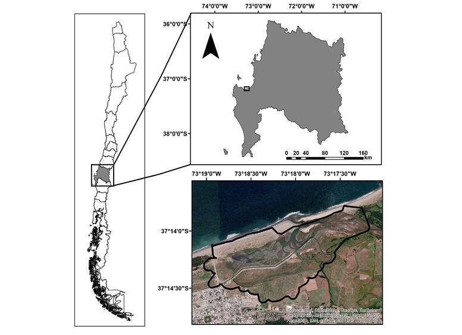

```{r setup, include=FALSE}
knitr::opts_chunk$set(echo = F, warning = FALSE, error = FALSE, message = FALSE)
library(tidyverse)
library(lubridate)
library(dplyr)
library(naniar)
library(zoo)
library(forecast)
library(tseries)
library(readxl)
library(broom)
library(bfast)
library(DBEST)
library(devtools) 
library(car)
library(broom)
```


# INTRODUCCIÓN 

## Humedales Costeros
Los humedales costeros son interfaces importantes entre ecosistemas de agua dulce, marinos y terrestres, comúnmente considerados como zonas intermedias de transición donde varios ecosistemas se unen e interactúan (Attrill & Rundle, 2002). Estos ecosistemas son fuentes de agua y productividad primaria de las que muchas especies vegetales y animales dependen para subsistir, presentando una alta biodiversidad, además, brindan una serie de servicios ecosistémicos a los seres humanos por lo cual son considerados como unos de los ecosistemas más productivos tanto económica como ecológicamente (Mitsch & Gosselink. 2007).
Los humedales ocurren donde las condiciones hidrológicas impulsadas por el clima, la topografía, la geología y los suelos causan saturación de la superficie de la duración suficiente para formar suelos hídricos y favorecen competitivamente la vegetación hidrofítica (Jackson et al., 2014), a su vez la vegetación va a modificar la hidrodinámica de la marisma, mejorando así la deposición de sedimentos y la erosión en la plataforma del humedal (Fagherazzi et al., 2012), por lo cual  la topografía, la hidrología y los procesos ecológicos se encuentran en constante interacción.
En climas mediterráneos, el patrón hidrológico estacional dentro del humedal es uno de los controles dominantes de la dinámica de la vegetación, el cual puede verse fuertemente afectado por: (i) terremotos, donde alzamientos co-sismicos pueden provocar condiciones de sequía y pérdida del régimen de marea al interior del humedal, generando una sucesión vegetacional desde vegetación halotolerantes a vegetación de agua dulce o terrestre (Valdovinos et al., 2010 ; Thilenius, 1996; Boggs & Shephard, 1999; Reid et al., 2017); (ii) aumentos en el nivel del mar, que generan inundación de hábitat disponible y cambios en el rango de distribución de la vegetación (Austin & Rehfisch, 2003); (iii) aumento en la frecuencia de tormentas, que provocan inundaciones y muerte de la vegetación (Hopkinson et al., 2008; Parmesan et al., 2000); y (iv) aumento de la sequía, condición que resulta en una forzante para el reemplazo de especies (Brown & Pezeshki, 2007; Gedan & Bertness, 2009). Por otro lado, el aumento de temperaturas también afecta a la vegetación provocando estrés, cambios en la fenología y cambios de rango de distribución de la vegetación (Kirwan et al., 2009)
Una forma de abordar los efectos que puede tener el cambio climático o las perturbaciones sobre los humedales costeros es a partir del estudio de la fenología, la cual se entiende como el patrón de variación estacional de la vegetación en la superficie de la tierra observada a partir de teledetección (White et al., 2006), estando los cambios estacionales de la vegetación relacionados con los diferentes periodos de brotación, floración y senescencia que presentan (Callaway & Josselyn, 1992; Peng et al., 2014), los que se relacionan con el clima (de Beurs y Henebry, 2005) y con  perturbaciones biogénicas o antropogénicas (White et al., 2009).
Debido a que la vegetación tiene un particular comportamiento espectral se han podido construir series de tiempo basadas en información satelital, como por ejemplo, el Índice de Vegetación de Diferencia Normalizada (NDVI, por sus siglas en ingles) y el Índice de Vegetación Mejorado (EVI, por sus siglas en ingles), los cuales son ampliamente aceptados como indicadores sensibles que puede usarse para monitorear variaciones fenológicas (Wang y Tenhunen, 2004 , Xie et al., 2008 ), biomasa verde (Rosental et al., 1985; Tucker et al., 1985; Prince, 1991), índice de área foliar (Asrar et al., 1984) y patrones de productividad (Goward & Dye, 1987), permitiendo así monitorear la condición de crecimiento de las plantas de humedales (Dong et al., 2014).

# OBJETIVOS

El objetivo de este trabajo consiste en evaluar la relación entre dos índices espectrales (NDVI y EVI) en un humedal costero del sur de Chile y analizar su fenología para un período de 16 años.

# MATERIALES Y MÉTODOS
## Área de estudios

El área de estudio corresponde al Humedal Carampangue ubicado en la región del Biobío. Esta zona fue afectada por el terremoto del 27 de febrero del 2010 y en ella ocurrieron los mayores alzamientos cosismicos registrados en todo el país, con un levantamiento de 1.45 m en la localidad de Tubul (a ~11 km del humedal Carampangue) y de 0.81 m a 3 km del humedal Carampangue (Vigny et al., 2011)
Este humedal costero es influenciado por el río Carampangue en el extremo norte. Hidrológicamente este estuario, ayuda en el control de las inundaciones, reduce la energía del oleaje y permite el mantenimiento de la conectividad ecosistémica. La flora de la zona costera de este humedal es dominada por la especie Spartina densiflora con bajas coberturas de Salicornia fruticosa (Valdovinos et al., 2010; Fariña et al., 2018), y presencia de individuos de la familia Juncaceae y Cyperaceae (EULA, 2011). 

{width=800px height=500px} 

## Base de datos

A partir de los productos MOD13Q1 y MYD13Q1 (versión 006) del espectro radiómetro de imágenes de resolución moderada (MODIS) TERRA y AQUA entre los años 2003 y 2018 descargados gratuitamente desde el siguiente sitio web  [link](https://daac.ornl.gov/), se generaron dos series de tiempo a partir de un solo pixel (de 250 metros de resolución espacial) con datos cada 8 días, una serie de tiempo de NDVI y otra de EVI. 
Además, se obtuvieron series de tiempo mensuales de temperatura y precipitación para el mismo periodo de tiempo de las estaciones meteorológicas de Carriel Sur para temperatura y Carampangue para precipitación.Ambas series de tiempo fueron obtenidad desde el explorador climático del Center for Climate and Resilience Research (CR2)

## Análisis de los datos
Se realizó una correlación lineal no paramétrica de Spearman para evaluar el grado de relación entre ambos índices y una descomposicion automatica de la serie de tiempo (con datos mensales) en los en componentes de tendencia, estacional y de ruido, por diagrama de Loess (STL).

# RESULTADOS


```{r, echo = FALSE, message = FALSE, warning = FALSE, error = FALSE, include=FALSE}

###################### NDVI ########################################

#Cargar archivo y añadir el nombre de las colunas
P2_NDVI_AQUA <- read.csv("P2_12_AQUA_NDVI.csv", header = F) 
colnames(P2_NDVI_AQUA) 
colnames(P2_NDVI_AQUA) <- c("Name", "Satelite", "Date", "Coordinates", "Info", "Resolution", "NDVI")

P2_NDVI_TERRA <- read.csv("P2_12_TERRA_NDVI.csv", stringsAsFactors=F)
colnames(P2_NDVI_TERRA, do.NULL = FALSE)
colnames(P2_NDVI_TERRA) <- c("Name", "Satelite", "Date", "Coordinates", "Info", "Resolution", "NDVI")

P2_EVI_AQUA <- read.csv("P2_12_AQUA_EVI.csv", header = F) 
colnames(P2_EVI_AQUA) 
colnames(P2_EVI_AQUA) <- c("Name", "Satelite", "Date", "Coordinates", "Info", "Resolution", "EVI")

P2_EVI_TERRA <- read.csv("P2_12_TERRA_EVI.csv", stringsAsFactors=F)
colnames(P2_EVI_TERRA, do.NULL = FALSE)
colnames(P2_EVI_TERRA) <- c("Name", "Satelite", "Date", "Coordinates", "Info", "Resolution", "EVI")

#Unir ambos sensores
P2_NDVI <- rbind(P2_NDVI_TERRA, P2_NDVI_AQUA, deparse.level = 1)
# Eliminar columnas que no interesan 
P2_NDVI <- P2_NDVI %>% select("Satelite", "Date", "Coordinates","NDVI")

# Fecha y Coordenadas

P2_NDVI <- P2_NDVI %>% mutate(Date = gsub("[a-zA-Z ]", "", P2_NDVI$Date)) # Elimino la letra A del principio de la fecha

P2_NDVI <- P2_NDVI %>% mutate(Date = (as.Date(P2_NDVI$Date, format ="%Y%j")), Month = month(Date), Year = year(Date), Day = day(Date)) %>% 
  select(Satelite, Date, Month, Year, Day, everything()) %>% 
  mutate(Coordinates = gsub("[Lat,Samp1Line1]", "", P2_NDVI$Coordinates)) %>% 
  separate(Coordinates, c("Lat", "Lon"), "o") 

# Reemplazar con Na valores que faltan (descritos aquí con la letra F)

P2_NDVI <- P2_NDVI %>% replace_with_na(replace = list(NDVI = "F"))

#  Cambiar a numerico la columna de NDVI
P2_NDVI <- P2_NDVI %>% mutate(NDVI = as.numeric(NDVI))

# Reemplazar los NaN con interpolación lineal cubica, me arroja error solo usar spline

P2_NDVI <- P2_NDVI %>% mutate(NDVI = na.spline(P2_NDVI$NDVI)) %>% arrange(Date)

P2_NDVI_mensual <- P2_NDVI %>%  group_by(Year, Month) %>% summarise(Mean = mean(NDVI), sd = sd(NDVI)) %>% ungroup()

################################ EVI ##########################################

#Unir ambos sensores

P2_EVI <- rbind(P2_EVI_TERRA, P2_EVI_AQUA, deparse.level = 1)

# Eliminar columnas que no interesan 

P2_EVI <- P2_EVI %>% select("Satelite", "Date", "Coordinates","EVI")


# Fecha y Coordenadas

P2_EVI <- P2_EVI %>% mutate(Date = gsub("[a-zA-Z ]", "", P2_EVI$Date)) # Elimino la letra A del principio de la fecha

P2_EVI <- P2_EVI %>% mutate(Date = (as.Date(P2_EVI$Date, format ="%Y%j")), Month = month(Date), Year = year(Date), Day = day(Date)) %>% 
  select(Satelite, Date, Month, Year, Day, everything()) %>% 
  mutate(Coordinates = gsub("[Lat,Samp1Line1]", "", P2_EVI$Coordinates)) %>% 
  separate(Coordinates, c("Lat", "Lon"), "o") 

# Reemplazar con Na valores que faltan (descritos aquí con la letra F)

P2_EVI <- P2_EVI %>% replace_with_na(replace = list(EVI = "F"))

#  Cambiar a numerico la columna de NDVI
P2_EVI <- P2_EVI %>% mutate(EVI = as.numeric(EVI))

# Reemplazar los NaN con interpolación lineal cubica, me arroja error solo usar spline

P2_EVI <- P2_EVI %>% mutate(EVI = na.spline(P2_EVI$EVI)) %>% arrange(Date)

P2_EVI_mensual <- P2_EVI %>%  group_by(Year, Month) %>% summarise(Mean = mean(EVI), sd = sd(EVI)) %>% ungroup()

################################################# NDVI & EVI ##################################################################################

P2_NDVI_EVI <- cbind(P2_NDVI, P2_EVI$EVI, deparse.level = 1) %>% mutate(EVI = P2_EVI$EVI)
P2_NDVI_EVI_mensual <- cbind(P2_NDVI_mensual,P2_EVI_mensual$Mean, deparse.level = 1) %>%  dplyr::select(1, 2, 3, 5) 
colnames(P2_NDVI_EVI_mensual) 
colnames(P2_NDVI_EVI_mensual) <- c("Year", "Month", "NDVI", "EVI")

```


```{r TABLA,echo = F, message = F, warning = F}
Tabla <- P2_NDVI_EVI %>% summarise_at(vars("NDVI":"EVI"), list(Mean = mean, sd = sd)) %>% 
  select(NDVI_Mean, NDVI_sd, EVI_Mean, EVI_sd)  

```

Los datos muestran que NDVI registra valores que son practicamente el doble de los valores registrados por EVI, con un promedio de `r round(Tabla$NDVI_Mean, digits = 2)` ± `r round(Tabla$NDVI_sd, digits = 2)`, mientras que EVI registra un promedio de `r round(Tabla$EVI_Mean, digits = 2)` ± `r round(Tabla$EVI_sd, digits = 2)`. La figura \@ref(fig:Plot) muestra que ambas series de tiempo tienen una tendencia positiva y que en el caso de NDVI se observa una mayor dispersión de los datos durante la primera mitad del periodo de tiempo

```{r Plot, fig.width=8, fig.height=4, fig.cap="Serie de tiempo de NDVI y EVI"}

EVI_NDVI <- P2_NDVI_EVI %>% tidyr::gather("id", "value", 8,10)
ggplot(EVI_NDVI, aes(Date, value))+ geom_point()+ geom_smooth(method = "lm", se=FALSE, color="black")+ facet_wrap(~id) + xlab("Fecha") + ylab("")

```

```{r}
res2 <-cor.test(P2_NDVI_EVI$NDVI, P2_NDVI_EVI$EVI,  method = "spearman")

```

Ademas, si bien EVI presenta una distribución normal, NDVI presenta una distribución asimétrica hacia los valores más altos (figura \@ref(fig:histograma) y figura \@ref(fig:normalidad)). Por lo cual para evaluar la relación entre ambos indices se decidio hacer una correlación no paramétrica de Spearman. La cual mostró una alta correlación (rho = `r round(res2$estimate, digits = 2)`) estadísticamente significativa (p =`r round(res2$p.value, digits = 2)`) (Figura \@ref(fig:Correlacion))  

```{r histograma, fig.width=8, fig.height=4,  fig.cap="Histograma de EVI y NDVI"}
par(mfrow = c(1, 2))
hist(P2_NDVI_EVI$EVI,
main="EVI",
xlab="EVI",
freq=FALSE
)


hist(P2_NDVI_EVI$NDVI,
main="NDVI",
xlab="NDVI",
freq=FALSE
)


```

```{r normalidad, fig.cap="QQplots de EVI y NDVI"}
par(mfrow = c(1, 2))
qqPlot(P2_NDVI_EVI$EVI, pch = 16, col = c("#178A56AA"), col.lines = 6, cex = 1.5, main = "EVI", id = F, ylab = "EVI")
qqPlot(P2_NDVI_EVI$NDVI, pch = 16, col = c("#178A56AA"), col.lines = 6, cex = 1.5, main = "NDVI", id = F, ylab = "NDVI")
```


```{r Correlacion, fig.cap="Correlación"}
ggplot(P2_NDVI_EVI,aes(y=P2_NDVI_EVI$NDVI,x=P2_NDVI_EVI$EVI))+geom_point()+geom_smooth(method="lm") + xlab("EVI") + ylab("NDVI")

```

Las estimaciones mensuales de los índices de vegetación NDVI y EVI se intentaron explicar a partir de mediciones mensuales de temperatura y precipitación mediante regresiones lineales. El modelo 1 evaluó solo precipitación, el modelo 2 solo temperatura y el modelo 3 evaluó ambas variables (tablas \@ref(tab:Modelos_EVI) y \@ref(tab:Modelos_NDVI)). Se observó que temperatura y precipitación explican un porcentaje muy bajo de la varianza de NDVI y EVI

```{r, echo = FALSE, message = FALSE, warning = FALSE, error = FALSE, include=FALSE}
ppyt <- data.frame(read_excel("Data.xlsx"))

data <- cbind(P2_NDVI_EVI_mensual, ppyt, deparse.level = 1)
colnames(data, do.NULL = FALSE)
colnames(data) <- c("Year", "Month", "NDVI", "EVI", "Date", "pp", "T")

Fit1_NDVI <- lm(NDVI ~ pp, data = data)
Fit2_NDVI <- lm(NDVI ~ T, data = data)
Fit3_NDVI <- lm(NDVI ~ pp + T, data = data)

Fit1_EVI <- lm(EVI ~ pp, data = data)
Fit2_EVI <- lm(EVI ~ T, data = data)
Fit3_EVI <- lm(EVI ~ pp + T, data = data)

Modelo1_NDVI <- glance(Fit1_NDVI) %>% dplyr::select(r.squared, 
                                                    AIC) %>% mutate(Modelo = "Fit1")
Modelo2_NDVI <- glance(Fit2_NDVI) %>% dplyr::select(r.squared, 
                                                    AIC) %>% mutate(Modelo = "Fit2")
Modelo3_NDVI <- glance(Fit3_NDVI) %>% dplyr::select(r.squared, 
                                                    AIC) %>% mutate(Modelo = "Fit3")

Modelos_NDVI <- bind_rows(Modelo1_NDVI, Modelo2_NDVI, Modelo3_NDVI) %>% arrange(AIC) %>% mutate(DeltaAIC = AIC - 
                                                                                                  min(AIC)) %>% select(Modelo, r.squared, AIC, DeltaAIC)


Modelo1_EVI <- glance(Fit1_EVI) %>% dplyr::select(r.squared, 
                                                  AIC) %>% mutate(Modelo = "Fit1")
Modelo2_EVI <- glance(Fit2_EVI) %>% dplyr::select(r.squared, 
                                                  AIC) %>% mutate(Modelo = "Fit2")
Modelo3_EVI <- glance(Fit3_EVI) %>% dplyr::select(r.squared, 
                                                  AIC) %>% mutate(Modelo = "Fit3")


Modelos_EVI <- bind_rows(Modelo1_EVI, Modelo2_EVI, Modelo3_EVI) %>% arrange(AIC) %>% mutate(DeltaAIC = AIC - 
                                                                                              min(AIC)) %>% select(Modelo, r.squared, AIC, DeltaAIC)


```

```{r Modelos_EVI, echo = F, message = F, warning = F, fig.cap = Modelos_EVI}

knitr::kable(Modelos_EVI, digits = 2, caption = "Regresión lineal de EVI y precipitación (fit1), temperatura (fit2) y temperatura y precipitación (fit3)", full_width = F)
```


```{r Modelos_NDVI, echo = F, message = F, warning = F, fig.cap = Modelos_NDVI}

knitr::kable(Modelos_NDVI, digits = 2, caption = "Regresión lineal de NDVI y precipitación (fit1), temperatura (fit2) y temperatura y precipitación (fit3)", full_width = F)
```


Finalmente la descomposición de las series de tiempo de NDVI y EVI muestra que ambas series de tiempo presentan una tendencia positiva a partir del año 2009 aproximadamente con una disminución de la estacionalidad a partir del año 2010 (Figura \@ref(fig:STLEVI) y Figura \@ref(fig:STLNDVI))

```{r, echo = F, message = F, warning = F, include= F}
ts_P2_NDVI <- ts(P2_NDVI_EVI_mensual$NDVI, start=2003, frequency=12)  # Le decimos al programa directamente que esto es una serie de tiempo
ts_P2_NDVI
end(ts_P2_NDVI)

ts_P2_EVI <- ts(P2_NDVI_EVI_mensual$EVI, start=c(2003, 1), frequency=12)  # Le decimos al programa directamente que esto es una serie de tiempo
ts_P2_EVI
end(ts_P2_EVI)

```

```{r STLEVI, fig.cap="Descomposición serie de tiempo de EVI"}

stl_ts_P2_EVI <- stl(ts_P2_EVI, 12)
plot(stl_ts_P2_EVI, main= "Sitio 2",
     lwd=2,cex.main=4)
```


```{r STLNDVI, fig.cap="Descomposición serie de tiempo de NDVI" }

stl_ts_P2_NDVI <- stl(ts_P2_NDVI, 12)
plot(stl_ts_P2_NDVI, main= "Sitio 2",
     lwd=2,cex.main=4)
```

# Conclusión


El análisis temporal de los índices de vegetación NDVI y EVI estimados en el Humedal Carampangue muestran que, si bien los índices de vegetación NDVI y EVI presentan una alta relación no lineal, se registraron valores de NDVI que prácticamente duplican las estimaciones de EVI. Estas diferencias en estimación pueden deberse a que, si bien NDVI considera los efectos topográficos en términos de la reflectividad (lo que resulta importante en áreas montañosas), EVI reduce los efectos adversos de factores ambientales como las condiciones atmosféricas y el fondo del suelo (Holben & Justice, 1991). Si bien, aunque ambos índices están altamente correlacionados y registran los mismos cambios temporales, considerando que el área de estudio es una zona baja y plana y que EVI considera las condiciones ambientales y de fondo de suelo, pareciera más adecuado utilizar este índice de vegetación para estudios fenológicos.
Se registró también que la precipitación y la temperatura explicaron un porcentaje muy bajo de la variación observada en ambos índices, esto probablemente porque al ser una zona muy lluviosa puede existir un desacoplé entre la lluvia y la vegetación. 
Por último, se observa que previo al terremoto ambos índices registran una estacionalidad marcada. Esto puede tener distintas explicaciones, por un lado, al haber mayor cantidad de agua en el humedal durante el invierno las características espectrales del agua hacen que la mayor parte de las longitudes de onda sean absorbidas obteniendo así valores de NDVI más bajos. Por otro lado, efectivamente durante el invierno el verdor podría estar disminuyendo, ya sea por una sucesión de especies halo tolerantes en el verano a dulceacuícolas en el invierno o a que la misma especies presenta cambios estacionales de verdor. Este humedal se encuentra dominado por la especie halófita facultativa Spartina densiflora (Fariña y cols., 2018), estudios en especies de Spartina alterniflora y Spartina foliosa encontraron que ambas especies comienzan a florecer a mediados del verano, con un máximo de su biomasa a mediados de otoño y senescencia a finales de otoño (Callaway & Josselyn, 1992), lo que explicaría la estacionalidad observada en ambos índices. Posterior a la ocurrencia del terremoto se observa una disminución de la estacionalidad observada y un aumento de la tendencia (la cual comienza a aumentar aproximadamente 1 año antes del terremoto), esto puede relacionarse son una posible sucesión vegetacional de especies halo tolerantes estacionales como Spartina densiflora, por especies más terrestre o de agua dulce más perennes, debido a que estudios han registrado que posterior a alzamientos cosismicos se pueden generar condiciones de sequía y pérdida del régimen de marea al interior de humedales costeros, generándose así una sucesión vegetacional desde vegetación halotolerantes a vegetación de agua dulce o terrestre (Valdovinos et al., 2010 ; Thilenius, 1996; Boggs & Shephard, 1999; Reid et al., 2017). Aún así, para concluir esto de manera robusta hacen falta muestreos in situ y el uso de imágenes satelitales de mayor resolución espacial.

# Referencias
- 
- Attrill, M. J., & Rundle, S. D. (2002). Ecotone or ecocline: ecological boundaries in estuaries. Estuarine, Coastal and Shelf Science, 55(6), 929-936.
- Boggs K. & Shephard M. (1999). Response of marine deltaic surfaces to major earthquake uplifts in southcentral Alaska. Wetlands, 19(1), 13-27.
- Callaway, J. C., & Josselyn, M. N. (1992). The introduction and spread of smooth cordgrass (Spartina alterniflora) in South San Francisco Bay. Estuaries, 15(2), 218-226. 
- Dong Z., Wang Z., Liu D., Song K., Li L., Jia M. y Ding Z. (2014)  Mapping wetland areas using landsat-derived ndvi and lswi: A case study of west Songnen plain, Northeast China. Journal of the Indian Society of Remote Sensing. 42, 569–576
- EULA. (2011). Diagnóstico y propuesta para la conservación y uso sustentable de los humedales lacustres y urbanos principales de la región del Biobío. Propuesta metodológica para el manejo y gestión para los humedales de la región del Biobío. Universidad de Concepción. Concepción, Chile
- Fagherazzi, S., Kirwan, M. L., Mudd, S. M., Guntenspergen, G. R., Temmerman, S., D'Alpaos, A., van de Koppel, J., Rybczyk, J., Reyes, E., Craft C. & Clough, J. (2012). Numerical models of salt marsh evolution: Ecological, geomorphic, and climatic factors. Reviews of Geophysics, 50(1).
- Holben, B., & Justice, C. (1981). An examination of spectral band ratioing to reduce the topographic effect on remotely sensed data. International journal of remote sensing, 2(2), 115-133.
- Lefeuvre, J. C., Bouchard, V., Feunteun, E., Grare, S., Laffaille, P., & Radureau, A. (2000). European salt marshes diversity and functioning: the case study of the Mont Saint-Michel bay, France. Wetlands Ecology and Management, 8(2-3), 147-161.
- Mitsch, W. J., & Gosselink, J. G. (2007). Wetlands. Hoboken. ed: John Wiley & Sons, Inc.
-Peng, D. L., Zhou, B., Li, C. J., Huang, W. J., Wu, Y. P., & Yang, X. H. (2014). Phenological characteristics of the main vegetation types on the Tibetan Plateau based on vegetation and water indices. In IOP Conference Series: Earth and Environmental Science (Vol. 17, No. 1, p. 012077). IOP Publishing.
- Reid C., Cochran U., Clark K., Marsden I., Litchfield N., & Ries W. (2017). Salt marsh plant response to vertical deformation resulting from the February 2011 Christchurch earthquake. New Zealand Journal of Geology and Geophysics, 60(3), 220-238.
- Thilenius F. (1996). Phytosociology and succession on earthquake-uplifted coastal wetlands, Copper River Delta, Alaska. Oceanographic Literature Review, 3(43), 288.
- Valdovinos, C., Muñoz, M. D., Sandoval, N., Vásquez, D., & Olmos, V. (2010). Desastres naturales y biodiversidad: el caso del humedal costero Tubul-Raqui.
- Vigny C., Socquet A., Peyrat S., Ruegg J.C., Métois M., Madariaga R., Morvan S., Lancieri M., Lacassin R., Campos J., Carrizo D., Bejar-Pizarro M., Barrientos S., Armijo R., Aranda C., Valderas-Bermejo M.C., Ortega I., Bondoux F., Baize S., Lyon-C., Pavez A., Vilotte J.P., Bevis M., Brooks B., Smalley R., Parra H., Baez J.C., Blanco M., Cimbaro S. y Kendrick E. (2011). The 2010 Mw 8.8 Maule megathrust earthquake of central Chile, monitored by GPS, Science. 332, 1417–1421.
- White M., Nemani R. (2006) Real-time monitoring and short-term forecasting of land surface phenology. Remote Sens. Environ, 104, 43–49.
- Xie, Y.C., Sha, Z.Y. & Yu, M. (2008). Remote sensing imagery in vegetation mapping: areview. J. Plant Ecol. 1, 9–23.

## R Markdown

This is an R Markdown document. Markdown is a simple formatting syntax for authoring HTML, PDF, and MS Word documents. For more details on using R Markdown see <http://rmarkdown.rstudio.com>.

When you click the **Knit** button a document will be generated that includes both content as well as the output of any embedded R code chunks within the document. You can embed an R code chunk like this:

```{r cars}
summary(cars)
```

## Including Plots

You can also embed plots, for example:

```{r pressure, echo=FALSE}
plot(pressure)
```

Note that the `echo = FALSE` parameter was added to the code chunk to prevent printing of the R code that generated the plot.
